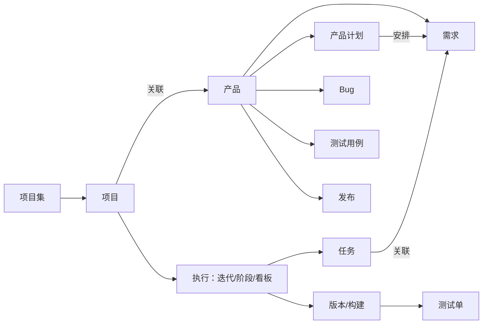

# 禅道与 zentao-cli 速览

供 [SKILL.md](SKILL.md) 按需读取。用户只想了解概念时，介绍与当前角色相关的对象即可。

## 对象怎么串起来

禅道覆盖需求、项目、任务、Bug、测试与交付管理。产品承载需求；项目组织研发工作并关联产品；执行按项目模型表现为迭代、阶段或看板，任务在执行中推进。



这是常见路线，不是所有关系的穷举。产品计划安排交付范围和时间，不等于执行迭代；测试单指定提测版本，也可关联执行。不要仅凭图中关系推断 CLI 有相应关联动作。

## 安装与登录

先复用已经可用的 CLI 或 MCP。`zentao` 命令不存在时，先向用户说明需要安装 zentao-cli，再按其已有的包管理器安装，装完用 `zentao --version` 验证：

```bash
npm install -g zentao-cli   # 或 bun / pnpm install -g zentao-cli
npx zentao-cli <参数>        # 不全局安装时的一次性运行方式
```

机器上没有包管理器或安装失败时，把官方下载引导页交给用户：https://www.zentao.net/download/cli-86306.html （含安装、登录鉴权、MCP 接入与 FAQ）。安装期间不必中断 tour，可先离线讲解对象与工作流。

让用户在自己的交互终端登录，按提示输入服务地址、账号和凭证：

```bash
zentao login
```

不要让用户把密码或 Token 发到聊天里，也不要把真实凭证写进命令参数、示例、日志或仓库文件。无法进行交互输入时，使用用户已安全注入的 `ZENTAO_URL`、`ZENTAO_ACCOUNT` 和 `ZENTAO_PASSWORD` / `ZENTAO_TOKEN`；需要强制按这些环境变量登录时使用 `zentao login --useEnv`。不要为检查变量而打印值。

默认配置在 `~/.config/zentao/zentao.json`，保存账号、服务器和 Token，不保存密码。`--config` / `ZENTAO_CONFIG_FILE` 可指定其他配置文件；沿用用户当前配置，不读取或展示整份凭证文件。

## 就绪检查与离线帮助

```bash
zentao profile
zentao product --pick=id,name --page=1 --recPerPage=5
```

第一条只读本地账号列表，不验证凭证、连通性或角色；第二条才是一次真实的只读业务请求。用户已指定别的业务范围时，可用该范围内的只读请求替代产品查询。产品返回空列表不代表服务未连通，更不代表必须新建产品。没有本地 profile（E1006）但已配置环境凭证时，也不能据此认定无法使用。

CLI 已安装但尚未登录时，仍可使用：

```bash
zentao version
zentao my tasks --help
zentao task start --help
zentao task props --format=json
```

`version` 展示 CLI 版本及本地记录的服务器信息，不主动验证服务端版本。操作帮助列出输入参数与最低禅道版本；`props` 展示返回对象属性，不能据此猜测写入参数。实际业务请求会获取服务端配置并检查当前版本，帮助中有操作不等于当前服务器和账号允许执行。

新增操作如 `my tasks`、`my bugs`、`execution projectExecutions` 通常要求 22.5 / biz13.5 / max8.5 / ipd5.5，具体按操作帮助。出现 E2010 时按角色文件降级；服务配置/版本不合法（E2011 / E2012）时先解决配置问题。

## MCP 接入

已连接 MCP 时直接复用。无需登录的 `zentao_action_help` 接受 `{"module":"my","action":"tasks"}` 等参数，返回路径、参数类型、必填项及 `minVersion`；适合先讲解能力，再连接业务环境。业务调用使用实际暴露的模块工具及其参数，不把 CLI 命令字符串当作 MCP 参数。

用户需要配置 MCP 时，先查看本地支持的目标，再为他选定的客户端安装：

```bash
zentao add-mcp --help
zentao add-mcp cursor
```

第二条是用户选用 Cursor 时的示例，会将当前服务器、账号和 Token 写入该客户端的本地 MCP 配置；应在用户要求配置该客户端的范围内使用，不自动配置全部客户端。不要打印配置里的 Token。CLI 认证细节见 [zentao-cli 技能](../zentao-cli/SKILL.md)。

## 查询结果的边界

默认 Markdown 适合浏览，`--format=json` 适合处理结构化数据。查询候选时可以只看一页；做完整统计时，根据返回 `pager` 逐页读取，保留统计所需字段，并记录账号可见范围。

`--filter`、`--sort`、`--search`、`--pick`、`--limit` 都在客户端处理当前页。单个 `--filter` 内的条件是 AND，重复该选项表示 OR。服务端 `browseType`、`orderBy`、`filters` 则以当前操作帮助为准；各操作的默认范围并不相同。只对帮助列出分页参数的操作使用分页选项，不能用 `--all` 自动拉全量。

## 外部资料

- [禅道官网](https://www.zentao.net/)
- [禅道使用手册](https://www.zentao.net/book/zentaopms/38.html)
- [zentao-cli 仓库](https://github.com/easysoft/zentao-cli)
